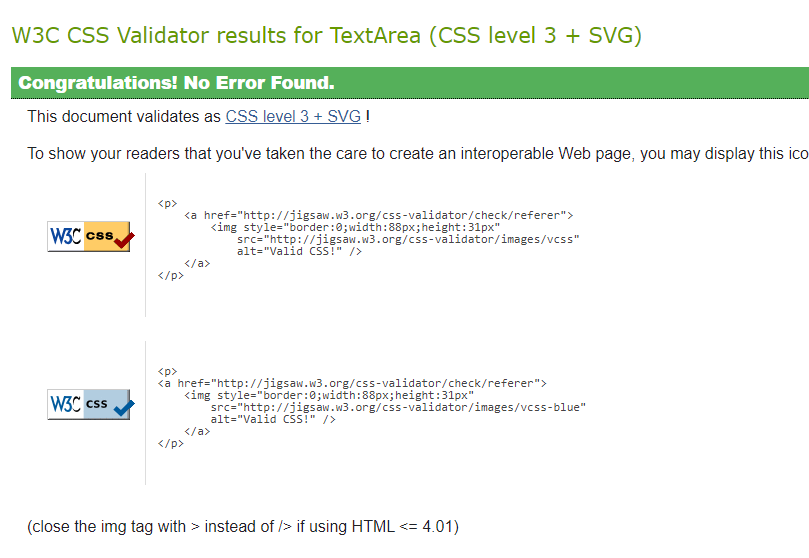
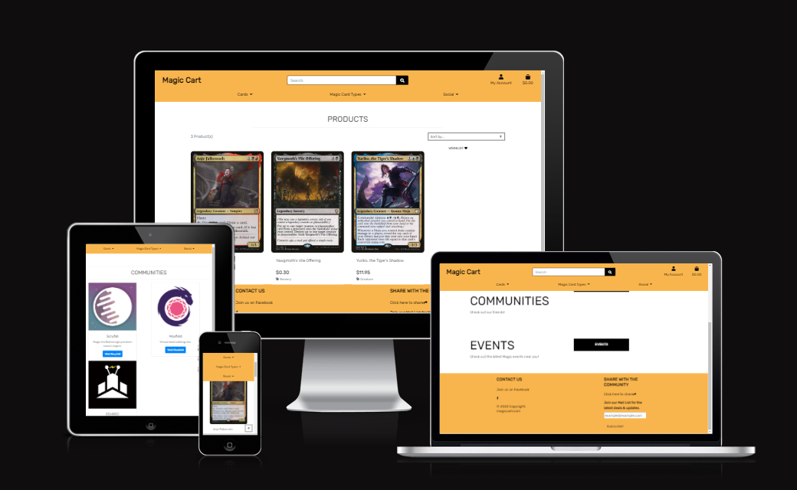
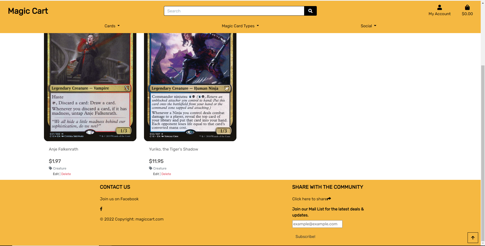
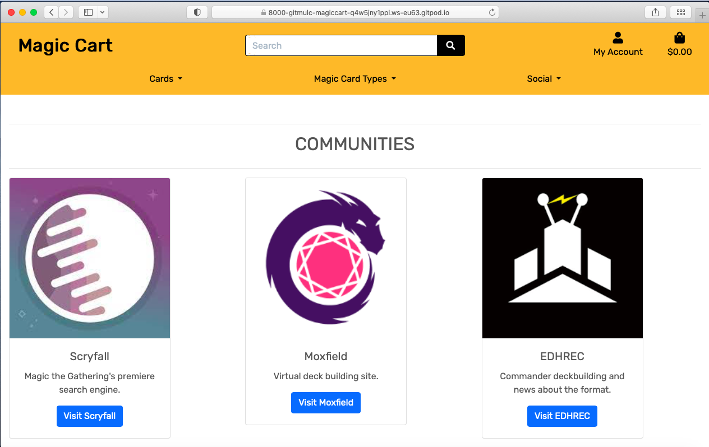
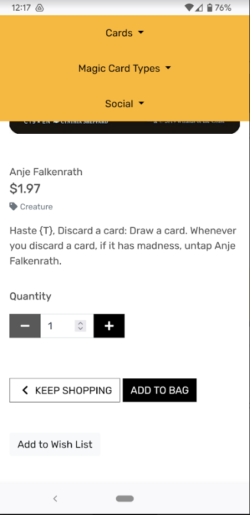
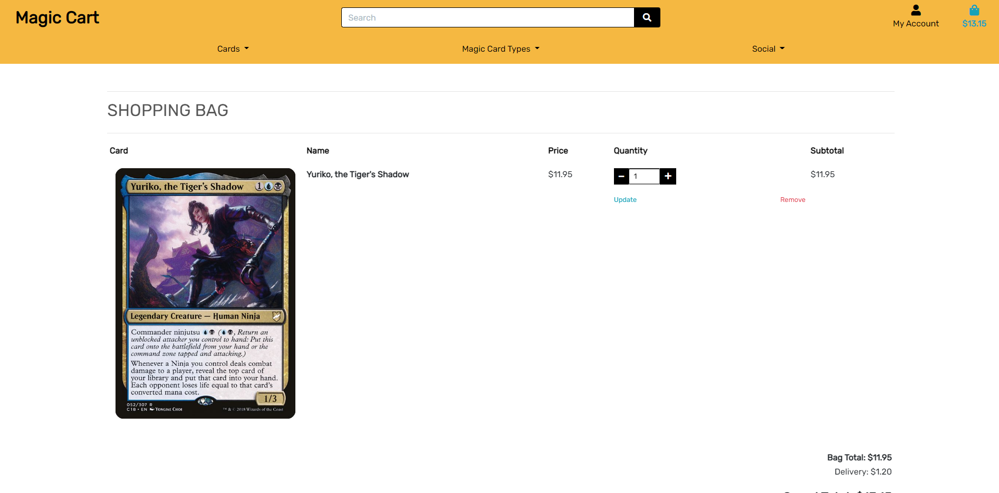
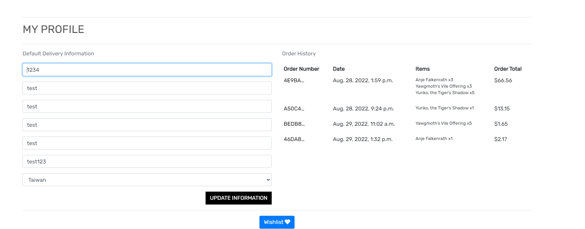
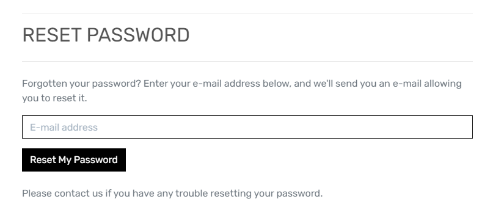
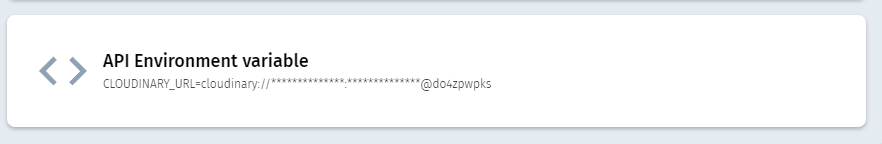

# Magic Cart

Magic Cart is an online e-Commerce store designed to sell magic cards and to also inform the customer on any other Magic the Gathering websites &/or events. The primary purpose of the website is to sell the user Magic the Gathering cards from one supplier.

The final deployed site can be found here https://magic-cart.herokuapp.com/

## User Stories

- As a customer I want to be able to view all the details (price, image) of each magic card on the store so that I can make a well informed purchase when visiting the site.

- As a user I want to be able to make a purchase so that I can receive the items from the online store.

- As a customer I want to be able to search for a specific magic card using its details or name so that I can find the card I'm looking for easily.

- As a site user I want to be able to easily register for an account so that I can have my own profile with my own preferences such as previous orders and delivery details.
- As a site user I want to be able to login and logout from my account so that I can access my profile when I want to.
- As a site user I want to be able to recover my password if I forget it so that I can regain access to my account.

- As a user I want to be informed on some Magic the Gathering websites so that I can get more involved in the community and inform me more on purchases.
- As a user I want to be able to know about any updates to the site, including sales, site updates so that I can capitalize on them and be more well informed on the site, which will encourage me to visit more often. I also want to be informed on any Magic the Gathering events taking place, such as tournaments, so that I can get more involved with the community.

## UX

Magic Cart was created primarily as an e-commerce store. Additional features such as wishlist, events and community sharing were added to keep user engagement up and get them more engaged with the Magic the Gathering community. 

### Colour Scheme

The `#F5B841` orange colour was utilised as it is similar to the colour of the orginal Magic: The Gathering logo font. This original logo served as inspiration for the colour scheme. This colour was used in the menu bar, and footer.

A black colour `#000000` was used for most of the text on the site, primarily for the `
` sections. This colour font serves as an excellent contrast to the `#F5B841` colour used. It was also used in the footer for social media icons and to highlight the form link.

The white colour `#ffffff` was used as a secondary background colour to compliment the harsh orange and make viewing things center of screen less harsh. Made it easier to focus on the details outside the header and footer.

[Magic Cart Colour Palette](documents/assets/magic-cart-colour-palette.png)

### Typography

The eczar font looks similar to the belern font used in Magic: The Gathering products and logos. Since the belern is a copyrighted font and cannot be used outside of Magic: The Gathering products, eczar was the font selected as the most appropriate.

### Lucid Charts

Lucid Charts [Lucid Charts](https://www.lucidchart.com/) is a web application that was used to generate the flow chart and entity relationship diagram for this e-commerce site.

- Magic Cart Flow Chart

- Magic Cart Entity Relationship Diagram

## Features

### Existing Features

- __Navbar__

- Allows the user to navigate the site.
- Features a registration button to allow new users to join the site.
- A login button, so that memebers can sign in.
- A logout button to allow the user to logout from their account.
- A shopping bag button to allow the user to easliy view their shopping bag.
- Drop down menus that allow the user to sort products using a specific parameter.
- A search bar to search for products.

- __Shopping Bag__

- A page that allows the user to check what items they are about to purchase. 
- Can be viewed at any stage.
- Can update your purchases quantity or remove it from the bag.
- Able to view the price of each item, subtotal and delivery cost.

- __Community Page__

- A page to view Magic the Gathering communities on the internet.
- Feature descriptions of each site, as well as a button that links you to the site.

- __Mail List__

- The footer of the site features an email input field and subscribe button, where the user can submit their email address and be added to the mail list.
- They will then be emailed about any upcoming sales, deals and other miscellaneous things about the site.

- __Profile__

- Each user can sign up and create their own unique user profile.
- This profile page contains their checkout information, order history and wishlist.

- __Wishlist__

- A page of products the user has added to their wishlist
- Each product on the site featues and 'Add to Wishlist' button to allow the user to easily add any product to their wishlist.
- Each users profile page has a link to their wishlist.

- __Events__

- A page which shows the users what upcoming Magic the Gathering events are taking place in the near future.
- This is controlled by the site admin.

- __Edit/Delete__

- For the site admin an edit and delete button is found on each product.
- This is to allow the site admin to edit a product's details, or delete/remove it from the site and make it unavailable for purchase.

- __Toasts__

- Toasts are featured on the site and serve as notifications to inform the user about any actions they may have perfomred such as purchasing, adding things to basket or wishlist etc.

### Features left to Implement

- I would like to implement more sellers on the site. So not only one vendor would be posting cards to sell.

## Technologies

- Django was used as the web framework for this project. [Django](https://www.djangoproject.com/)
- Python was used as primary programming language for this project. [Python](https://en.wikipedia.org/wiki/Python_(programming_language))
- HyperTextMarkup Langugae (HTML) was another programming language used for this project. It was utilised for the main content of the website and as the standard markup language. It was also used because of its ability to be used alongside Cascading Style sheets programming language. [HTML](https://en.wikipedia.org/wiki/HTML)
- Cascading Style Sheets (CSS) was the programming langugae used in conjunction with HTML. It was used to present the markup langugae HTML. CSS was used to put the HTML into a presentable form. [CSS](https://en.wikipedia.org/wiki/CSS)
- Git was the technology used for version control. It is free and open sourced. [Git](https://git-scm.com/)
- GitHub was used as a code hosting site for storing the code for this project online securely. [GitHub](https://github.com/)
- Gitpod is a cloud based IDE which was used to write the code for this project. [Gitpod](https://www.gitpod.io/)
- Heroku is a cloud based application. It was used for deployment of the application. [Heroku](https://www.heroku.com/home)
- Lucidchart is a web based tool that was used to create the entity relationship diagram and flowchart for this project. [Lucidchart](https://www.lucidchart.com/)
- Postgres is a cloud based database management system that uses SQL. [Postgres](https://www.postgresql.org/)

## Testing

### Code Validation

Python code was validated using PEP8 validator [PEP8](http://pep8online.com/).

- Python

- JavaScript
    - No errors were found when passing stripe_elements.js through the official [JSHint](https://jshint.com/)

    

    - No errors were found when passing countryfield.js through the official [JSHint](https://jshint.com/)

    

- CSS
    - No errors were found when passing base.css through the official Jigsaw Validator.
    
    

    - No errors were found when passing checkout.css through the official Jigsaw Validator.
    
    

    - No errors were found when passing profile.css through the official Jigsaw Validator.
    
    

### Browser Capability

### Responsiveness

- The responsiveness of this site was tested on 3 different devices desktop, tablet and mobile.
    - 
- Responsiveness on Desktop:
  - 
- Responsiveness on Tablet:
  - 
- Responsiveness on Mobile:
  - 

### Tested User Stories

- As a customer I want to be able to view all the details (price, image) of each magic card on the store so that I can make a well informed purchase when visiting the site.

  - 

- As a user I want to be able to make a purchase so that I can receive the items from the online store.

  - 

- As a customer I want to be able to search for a specific magic card using its details or name so that I can find the card I'm looking for easily.

  - 

- As a site user I want to be able to easily register for an account so that I can have my own profile with my own preferences such as previous orders and delivery details.

  - 

- As a site user I want to be able to login and logout from my account so that I can access my profile when I want to.

  - 

- As a site user I want to be able to recover my password if I forget it so that I can regain access to my account.

  - 

- As a user I want to be informed on some Magic the Gathering websites so that I can get more involved in the community and inform me more on purchases.
- As a user I want to be able to know about any updates to the site, including sales, site updates so that I can capitalize on them and be more well informed on the site, which will encourage me to visit more often. I also want to be informed on any Magic the Gathering events taking place, such as tournaments, so that I can get more involved with the community.

  - 

### Unfixed Bugs

### Deployment

- First step was to sign up to the Heroku online application using an email. Then authenticate and create your account on Heroku.

- 

- Then I went to my Heroku account dashboard and clicked new, then create new app.

- 

- 

- Next I gave my application a unique name polling-magic-community. Then I selected Europe for region.

- 

- I installed the add on Postgres to be used as the cloud based database for this project.

- 

- After the app is created I selected the settings tab. In here I clicked on the Reveal Config Vars button. I first obtained the API key from Cloudinary (the image hosting site used in this project) site. Then input it into the config vars.

- 

- A env.py was created were the keys for `DATABASE_URL`, `SECRET_KEY` and `CLOUDINARY_URL` would be held.

- I then added a secret key into the env.py file as well as the url from the linked postgres database. 

- 

- 

- 

- I then clicked on the Deploy tab. Here I selected GitHub as the deployment method. I then connected to my polling-magic repository on GitHub by typing it in and selecting it.

- Finally ensured that automatic deploys were from the main branch. I clicked on enable automatic deploys and built the app.

- 

- A Procfile was created into my local workspace in Gitpod. The Procfile is used for declaring what commands are run by your application’s dynos on the Heroku platform.

- After all relevant apps were installed, the requirements.txt file was created using the command `pip3 install -r requirements.txt`. Additionally all apps were listed/frozen onto this txt file using the command `pip3 freeze --local > requirements.txt`.

### Local Deployment

- All changes to the models.py file were followed by the command `python3 manage.py makemigrations` & `python3 manage.py migrate`to commit and push the changes to my local workspace.
- A super user was created using the command `python3 manage.py create superuser`. This was used to sign into the sites admin page.

- To make a local copy of this project, you can clone it by typing the following in your IDE terminal:

    - `git clone https://github.com/GitMulC/magiccart`

- Alternatively, if using Gitpod, you can click the green Gitpod button, or use [this link](https://gitpod.io/#https://github.com/GitMulC/magiccart) 

## Credits

### Content
- Code used for wishlist view taken from [YouTube](https://www.youtube.com/watch?v=OgA0TTKAtqQ&t=1984s)
- The icons in the footer were taken from [Font Awesome](https://fontawesome.com/)
- Coolors.co was used to generate a color palette for the site. [Coolors](https://coolors.co/)
- Responsive images were generated on the site Am I Responsive?. [Am I Responsive?](http://ami.responsivedesign.is/)
- Screenshots and images edited using graphic editor Microsoft Paint. [Mircosoft Paint](https://support.microsoft.com/en-us/windows/open-microsoft-paint-ead1dc5c-abc4-fd2c-d81e-ebb013fbc113)
- Footer structure and style taken from [mdbootstrap](https://mdbootstrap.com/docs/b4/jquery/navigation/footer/)

### Media

- Images for cards were taken from a json file found on Scryfall [Scryfall](https://scryfall.com/)

### Acknowledgments

- I want to thank Code Institute, (and it's tutors!) and my mentor Marcel for his assitance throughout this projects' development.