# Magic Cart Testing

[Back to the README.md file](https://github.com/GitMulC/magiccart/blob/main/README.md)

## Testing

### Testing User Stories

- As a customer I want to be able to view all the details (price, image) of each magic card on the store so that I can make a well informed purchase when visiting the site.
    - A products page is available and displays all products with their respective details

- As a user I want to be able to make a purchase so that I can receive the items from the online store.
    - A bag app & checkout app were created that allows user to add products in any quantity they want to a bag app. They then proceed to the checkout app to fill in required details (purchasing info & delivery info) to purchase what's in their bag.

- As a customer I want to be able to search for a specific magic card using its details or name so that I can find the card I'm looking for easily.
    - A search bar is available on top of the nav bar which users can utilise to search for a particular card they want.

- As a site user I want to be able to easily register for an account so that I can have my own profile with my own preferences such as previous orders and delivery details. As a site user I want to be able to login and logout from my account so that I can access my profile when I want to.
    - A login & register link is available on the nav bar. The profiles app handles signing in, out and registration. 
    - A sign up process allows the user to register for an account and within that account the user can input delivery information, view their previous orders, and also view their wishlist.

- As a user I want to be informed on some Magic the Gathering websites so that I can get more involved in the community and inform me more on purchases.
    - A community app displays helpful websites that the user is linked to in the social drop down menu on the header.
    - Additionally, in the footer, an email input field allows users to register for the mail list.

- As a user I want to be able to know about any updates to the site, including sales, site updates so that I can capitalize on them and be more well informed on the site, which will encourage me to visit more often. I also want to be informed on any Magic the Gathering events taking place, such as tournaments, so that I can get more involved with the community.
    - The events app which can be accessed by the social dropdown menu in the header of the site. This displays events for the user, the location, time and date.

### Code Validation

Python code was validated using PEP8 validator [PEP8](http://pep8online.com/).

- Python
    - Pylint was used continuously during the development process to analyze the Python code for programming errors. The code was then checked for errors via the terminal command "python3 -m flake8". This returned a number of whitespace and indentation errors which were rectified where  possible. (The unfixed errors were situated in root files such as .vscode/artictern). Other errors regarding unused imports were corrected by removing the unnecessary files.

- JavaScript
    - No errors were found when passing stripe_elements.js through the official [JSHint](https://jshint.com/)

    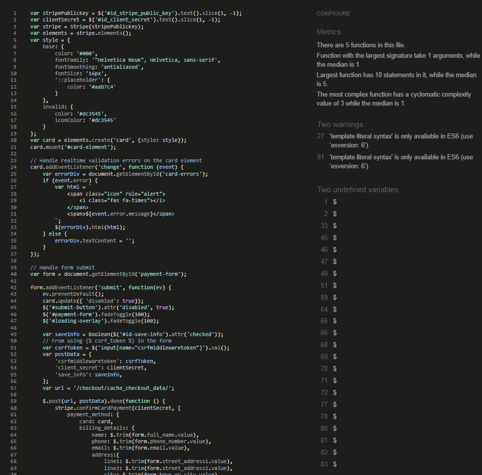

    - No errors were found when passing countryfield.js through the official [JSHint](https://jshint.com/)

    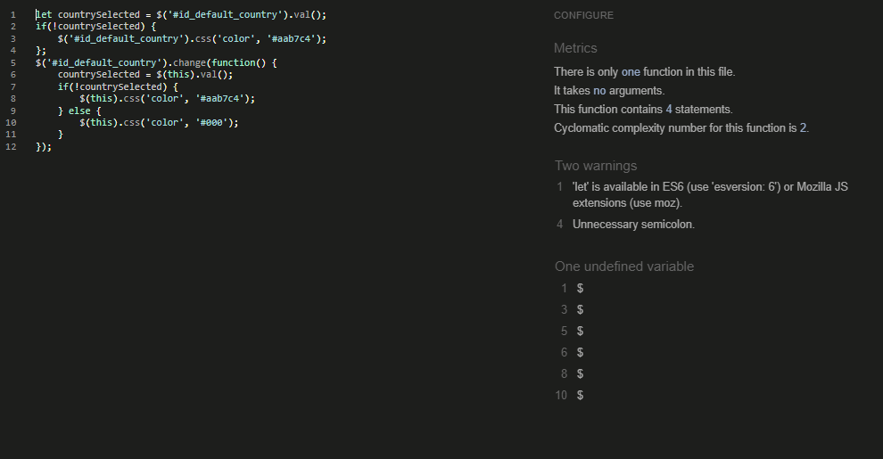

- CSS
    - No errors were found when passing base.css through the official Jigsaw Validator.
    
    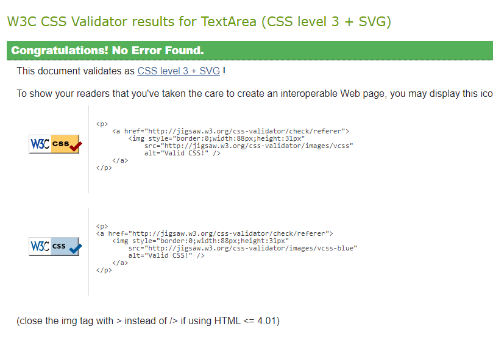

    - No errors were found when passing checkout.css through the official Jigsaw Validator.
    
    

    - No errors were found when passing profile.css through the official Jigsaw Validator.
    
    

### Browser Capability

### Responsiveness

- The responsiveness of this site was tested on 3 different devices desktop, tablet and mobile. The site was also tested on 3 separate browsers: Chrome, Firefox and Safari.

    - 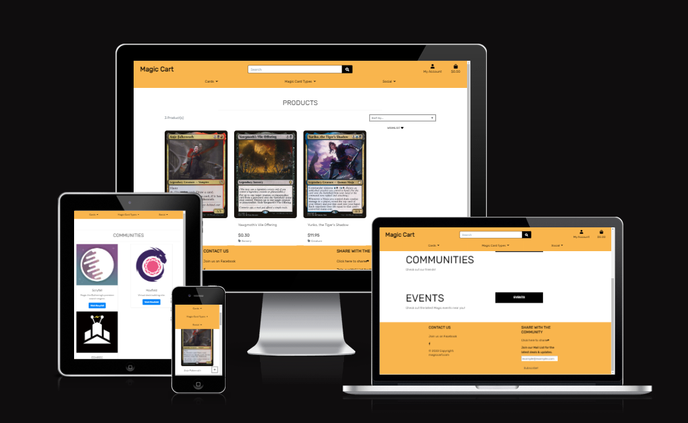
- Responsiveness on Desktop:
  - 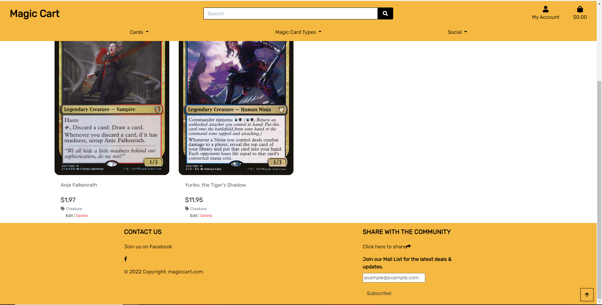
- Responsiveness on Tablet:
  - 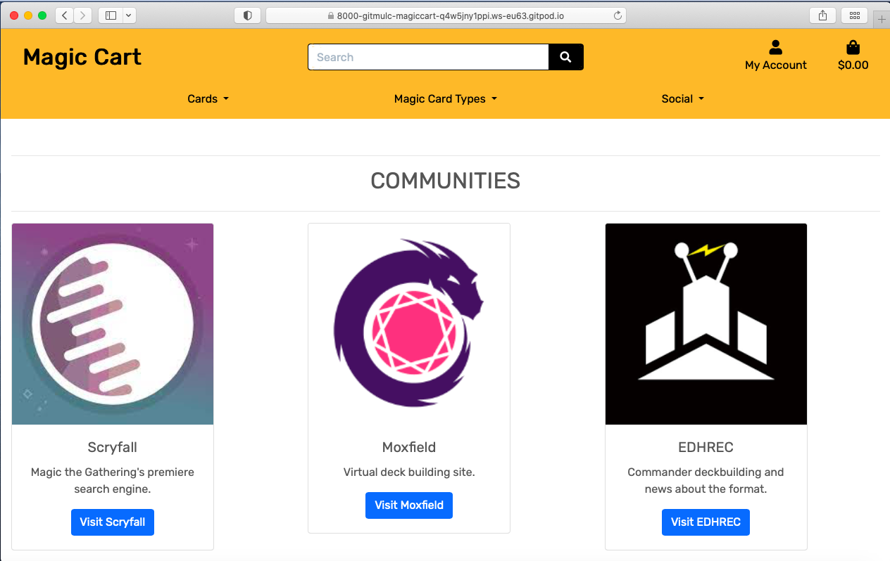
- Responsiveness on Mobile:
  - 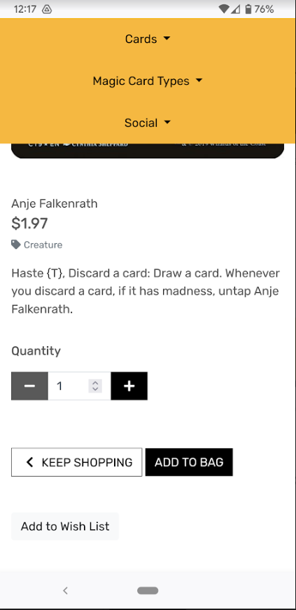

### Tested User Stories

- As a customer I want to be able to view all the details (price, image) of each magic card on the store so that I can make a well informed purchase when visiting the site.

  - 

- As a user I want to be able to make a purchase so that I can receive the items from the online store.

  - 

- As a customer I want to be able to search for a specific magic card using its details or name so that I can find the card I'm looking for easily.

  - 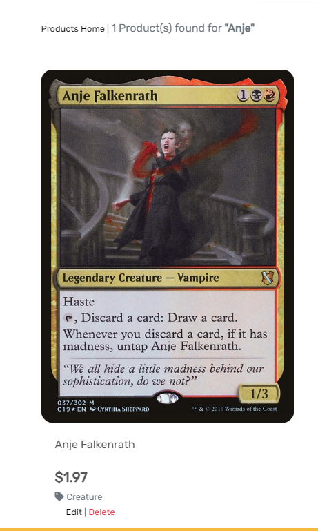

- As a site user I want to be able to easily register for an account so that I can have my own profile with my own preferences such as previous orders and delivery details.

  - 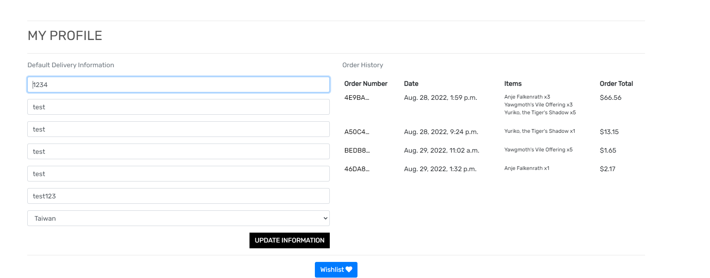

- As a site user I want to be able to login and logout from my account so that I can access my profile when I want to.

  - 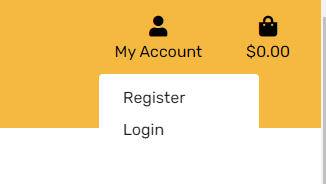

- As a site user I want to be able to recover my password if I forget it so that I can regain access to my account.

  - 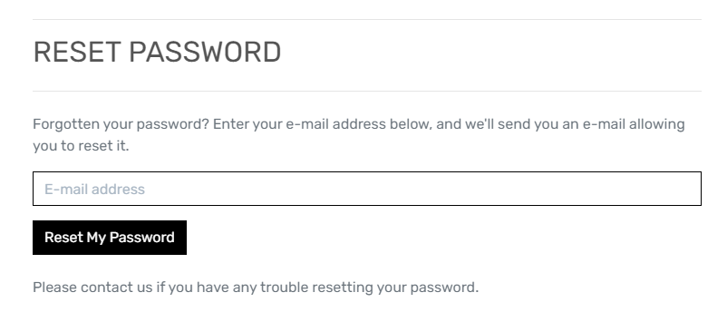

- As a user I want to be informed on some Magic the Gathering websites so that I can get more involved in the community and inform me more on purchases.
- As a user I want to be able to know about any updates to the site, including sales, site updates so that I can capitalize on them and be more well informed on the site, which will encourage me to visit more often. I also want to be informed on any Magic the Gathering events taking place, such as tournaments, so that I can get more involved with the community.

  - 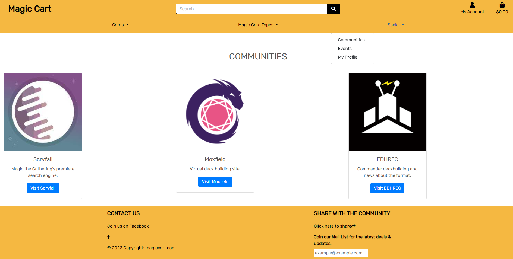
